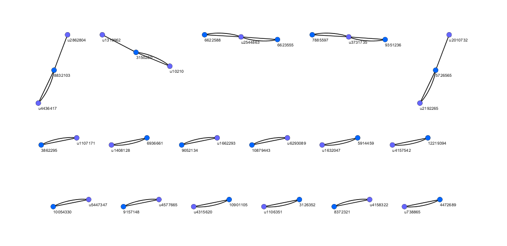
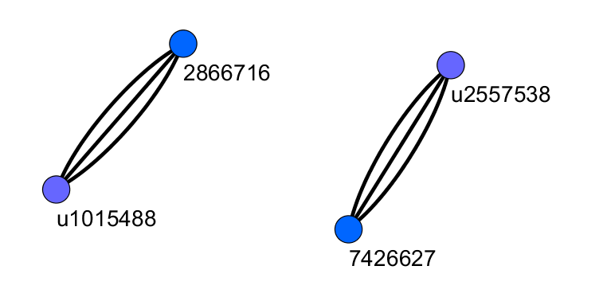
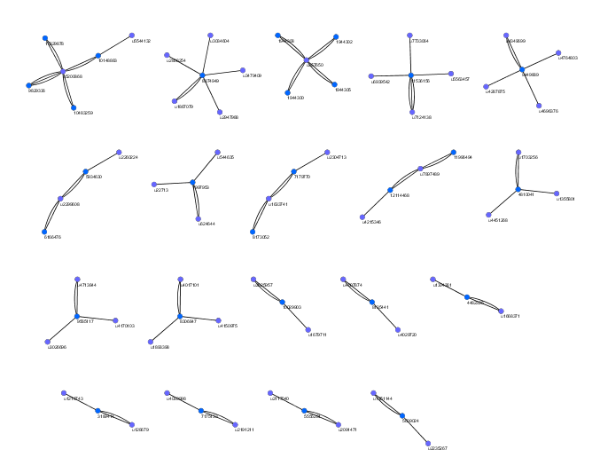
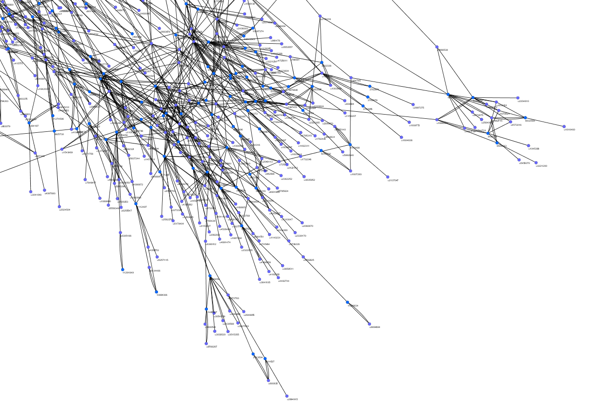

### i427 - Search Informatics - Final Project

Alexander L. Hayes - [FanFiction Search Engine](http://cgi.soic.indiana.edu/~hayesall/engine/index.html)

---

##### Table of Contents:

  1. [Changelog](#changelog)
  2. [Overview](#overview)
  3. [Terms and Conditions](#terms-and-conditions)
  4. [Background](#background)
  5. [Algorithm Design](#algorithm-design)
  6. [Network Images](#network)
  7. [Reviews](#reviews)
  8. [Further Work](#further-work)
  9. [Appendix / Code](#appendix)

---

##### Changelog:

1. *Update 12-14-2016:* I finished crawling all 6520 fanfics. During crawling, 10 could not be downloaded (I'll investigate those later).

  * Language Representation (in order of frequency): English (6044), Spanish (270), French (134), Indonesian (32), Polish (14), Catalan (13), Finnish (4), Portuguese (2).
  Dutch, German, Italian, Latin, Swedish, Norweigian, and Vietnamese each had one fanfic.

  * Extremely common words take quite a while to process (e.g.: character names from the show). I'll try to remedy this in the next version by creating a dictionary of dictionaries for words: documents in the inverted index are currently stored as lists and I suspect that iterating through 4000 lists is taking a long time.
  
---

##### Overview:

For the uninitiated, [FanFiction.Net](https://www.fanfiction.net/) has been around since 1998 and is the largest online repository of fanfics‒works of fiction written by the fans of existing stories‒films, books, tv shows, and video games. This search engine is my attempt at organizing [Code Lyoko](https://en.wikipedia.org/wiki/Code_Lyoko) fanfiction: the stories based on a French animated series I watched when I was younger. This particular community holds a special meaning to me since I read quite a bit between fourth and fifth grade. "Social media" wasn't a term I (or likely the public conciousness) was familiar with in 2004, but this online community of fan-writers was my first dive into the domain.

To paraphrase Professor Nick Mount, humans are art animals‒we seek to find meaning where there may otherwise be none, whether we can find it in myths, stories, or the reassembled shards of broken glass. Code Lyoko ran in the United States for four seasons between April 2004 and May 2007, but fans continue telling stories when the original creators leave. Human culture constantly evolves, being reformed each generation, shaped by the collective experiences of those who preceded. What untold stories has time forgotten? Which gods were born with the people who worshipped them and died when the last forgot them? What pieces of our language, culture, and identify as a species are founded in legends that no one remembers by ancestors that are now nameless?

> For the generation growing up now, the Internet is their window on the world. They take it for granted. It’s only us, who have seen it take shape, and are aware of all the ways it could have been different, who understand that it's fragile, contingent. The coming years will decide to what extent the Internet be a medium for consumption, to what extent it will lift people up, and to what extent it will become a tool of social control.

Maciej Cegłowski gave a great talk called ["Deep Fried Data"](http://idlewords.com/talks/deep_fried_data.htm) about machine learning, data collection, archiving the internet, and his fears that the web will become less free. Needless to say, I highly recommend it. FanFiction is not without opponents, plenty of authors see characters and stories as their own, and perhaps rightfully so. I hope this can be a useful tool to community members, I myself have never written a fanfic, but I hope in my own small way I can contribute to its existence and perhaps its preservation.

[Return to Top](#i427---search-informatics---final-project)

---

##### Terms and Conditions:

Refer to FanFiction.Net's ["Terms of Service"](https://www.fanfiction.net/tos/) for full details.

> E. You agree not to use or launch any automated system, including without limitation, "robots," "spiders," or "offline readers," that accesses the Website in a manner that sends more request messages to the FanFiction.Net servers in a given period of time than a human can reasonably produce in the same period by using a conventional on-line web browser. Notwithstanding the foregoing, FanFiction.Net grants the operators of public search engines permission to use spiders to copy materials from the site for the sole purpose of and solely to the extent necessary for creating publicly available searchable indices of the materials, but not caches or archives of such materials. FanFiction.Net reserves the right to revoke these exceptions either generally or in specific cases. You agree not to collect or harvest any personally identifiable information, including account names, from the Website, nor to use the communication systems provided by the Website (e.g. comments, email) for any commercial solicitation purposes. You agree not to solicit, for commercial purposes, any users of the Website with respect to their User Submissions.

[Return to Top](#i427---search-informatics---final-project)

---

##### Background

There exist several implementations for searching the content. I will provide a brief overview of each here with some discussion on their strengths and weaknesses.

1. [Built-in Search](https://www.fanfiction.net/search.php) on FanFiction.net includes these options: (implemented in Php)
  * Category: (example: Books >> Harry Potter)
  * Story, Writer, Forum, or Community.
  * Titles, Summaries, or both.
  * Crossovers, exclude crossovers, or any.
  * Sort by: relevance, update date, or publication date.
  * Results can then be narrowed by word count.

  Most of the time this could be enough.

2. [Dark Lord Potter's Advanced Search](http://scryer.darklordpotter.net/) has more powerful options: (implemented in Rails)
  * Search from 48 fandoms (Star Trek, Doctor Who, Babylon 5, Harry Potter, Buffy the Vampire Slayer)
  * Include results from 679 crossovers (Example: Star Trek in the Warcraft Universe)
  * Search by Title, Author, or Summary Keywords
  * Maximum of two required categories (Adventure, Angst, Supernatural, Romance)
  * Include/Exclude other categories
  * Narrow Search to stories focusing on specific characters from the fandoms
  * Include/Exclude Age Rating (K, K+, T, M)
  * Wordcount minimum, maximum.
  * Chapter minimum, maximum.
  * Sort by: Updated, Published, Wordcount, Chapters, Reviews, Favorites, Follows, "DLP Review Score," "Popular & Recent," "Long & Recent"
  * Descending/Ascending order
  
  Initially this appears to be a step in the right direction since it has a longer list of features. But the further you look into it, the more you realize it leaves a lot to be desired. The list of features is longer, but in reality there isn't much you can find with this search engine that you cannot find with FanFiction.Net's built-in implementation. Ultimately the search is still restricted to searching by title or the keywords in the summary, with the added benefit of being able to trim the categories a little further (by specifying word count, categories, and genre).

3. [Alexander's Code Lyoko Search Engine](http://cgi.soic.indiana.edu/~hayesall/engine/index.html): (implemented in Python and a bit of Bash)
  * Specific to one fandom (Code Lyoko)
  * Search results are sorted by document relavence and pagerank

  There are some major features that still need to be added to compete with the existing engines, but trading breadth for depth gives a huge bonus: searching the contents of an entire document rather than summary or title.


Imagine for a moment that you want all of Code Lyoko stories containing a reference to "Twitter." With the crawler rate I set, I was able to explore 328 stories (this doesn't sound very large, but required around 6000 requests to explore each chapter and review section). The crawler scraped backward through time: starting from the present and ending on October 2, 2015.

From these 328 documents published over the course of a year, seven results contain references to Twitter, while the [top result](https://www.fanfiction.net/s/12035101) has an underlying cyber-bullying theme. If you use the built-in search tool on FanFiction.Net, the [only result that comes up](https://www.fanfiction.net/s/8429561/1/Tweethearts) appears because the word "twitter" is in the title.

For the purpose of this example, I will not directly compare the results to those that would be obtained from Dark Lord Potter's search engine (it's a skewed comparison since it does not include Code Lyoko fanfiction).

[Return to Top](#i427---search-informatics---final-project)

---

##### Algorithm Design:

  

  _Blue [S] nodes represent stories, Violet [U] nodes represent users. Directed arrows are the edges between the nodes._

I consider two types of nodes: stories and users. Each are referenced with a unique identifier on the website that can easily be looked up by specifying "fanfiction.net/u/#" for users or "fanfiction.net/s/#" for stories.

Edges symbolize a type of contribution to the community:
  * Story [S] Nodes have a one-to-one relationship with the user that authored them.
  * User [U] Nodes point to stories, forming one-to-many relationships for the stories they write, or one-to-many relationships with the stories they review.

The resulting network (sample pictured above) symbolizes the contributions by community members in forms of writing or reviewing. If the goal is to match users with relevant results, the structure of the community--where other users gravitate to--is an interesting layer of complexity.

The assumption is that the larger role a user plays in the associated community (through writing popular stories), the more likely their stories are to be relevant, and the more likely it is that stories they review will be relevant.

[Return to Top](#i427---search-informatics---final-project)

---

##### Network:

A realized version of the network described above. Similar to the previous section, blue nodes represent stories, violet nodes represent users.

  

  _Single Edges are reviews, Double edges show a user wrote a story, Triple edges imply a user wrote and reviewed their own story._

  

  _Triple edges imply a user wrote and reviewed their own story._

  

  _Users tend to group around stories, though some stories receive only a small amount of attention._

  

  

  _Occasionally there are writers near the peripherals of the network that write a lot of stories, but their stories do not receive much attention._

  

  _But the majority of the network wraps into the connected component_

  

  _Approaching from the other side, as we move toward the center of the network we begin noticing "superstar reviewers" who contribute by reviewing a large number of stories._

  

  _The closer we get to the center, the more we notice the stories and users that are most central to the network. The overlapping connections begin to make it difficult to distinguish how many conections exist._

  

  _Perhaps it's best to take a step back and view the whole picture: 6520 stories in 15 languages written over the course of twelve years. Totalling to a little over 30,000 chapters and millions of words_

---

##### Reviews:

In retrospect, it's hard to justify my lack of consideration for fanfics not written in English. The show was originally produced in French and is fairly popular in Spain.

Between the two people I asked to review my results, one was fluent in Spanish, the other was fluent in French, and respectively: each lived in Spain or France for some period of time. All of us were fluent in English.

Both reported that the results made sense under two restrictions: typing random phrases and typing phrases I suggested as being related to the show. Queries submitted in a specific language tended to be effective at producing results in the target language. However, both noticed that short queries did not produce results *exclusively* in that language, especially in the cases where there were cognates or similar words in English. As an added complexity, Spanish queries more often would also return some results in French than French results would return results in Spanish. As the number of query terms increased though, this problem dissipated since term frequency was able to take over. Both reviewers were somewhat disappointed with the inability for the search engine to handle accented characters.

Explaining why things are the way they are would require further testing, but my suspicion is that it has to do with how words are stemmed and stopped. The nltk stopword dictionary only contains English words, and rules for the porter stemmer are based on English. In cases where there are cognates or similar words in English, it makes sense that queries in one language would occasionally produce results in a different language, and the influence of pagerank could also play a role in this.

Evaluating the results in English led me to make quite a few adjustments to the weights of pagerank or term-frequency. My original assessment was to multiply the scores: the pagerank numbers were so small compared to the term-frequency scores that addition was about the same as not including pagerank at all.

Simply multiplying the scores caused extremely popular stories (ones that typically had 100+ reviews) to dominate the search results, and simply due to their length it was common for them to have words that matched a wide variety of queries. After a decent amount of testing (heavily based on trial-and-error), I came up with: `Score = TermFrequency + (3 * PageRank)`. This seemed to strike the balance that I wanted, increasing the influence of pagerank by just enough that it could influence the final results without dominating them.

[Return to Top](#i427---search-informatics---final-project)

---

##### Further Work:

  * My **big** question: How are the communities shaped over time? (Azadeh worked on the [LinkedIn Economic Graph Challenge](http://news.indiana.edu/releases/iu/2015/06/iu-linkedin-project.shtml) for tracking economic trends over time. What are the cultural trends and shifts in FanFiction over time?)
  * Method for automatically adjusting the relevancy-scoring weights. I manually adjusted the weights of pagerank and term-frequency with the heuristic that the top few titles should make sense based on the keywords entered, and that a few stories should not dominate every query. I have document data in the form of term-frequency and metadata for each story, so it might be possible to create a classification model that adjusts the weights based on these features (a clever end-to-end deep-learning system perhaps?)
  * Each fanfic is associated with a small picture, how are the pictures related to the content? Reverse-search-by-image is a possibility in the meantime.
  * Weigh the number of reviews over the number of chapters: reviews are submitted on a chapter-by-chapter basis and longer stories naturally have a higher-than-average number of reviews. Popularity should instead be measured by the average number of reviews per chapter, and eventually: the number of times it has been favorited.
  * Narrow search results with metadata (data about the stories: title, summary, chapters, complete/incomplete, genre, age rating, language).
  * Currently there are some bugs when pulling metadata: characters are sometimes interpreted as the genre.
  * Stem based on language: stories exist in English, French, Spanish, Catalan, and Polish (from ones I've pulled so far)
  * Find a parser that works on non-latin written languages (Arabic, Chinese, Hindi, Japanese, Russian, to name a few).
  * Store page hashes to easily compute if one has been updated: complete stories will not be changed, but new reviews can be added.
  * Scrape metadata from user profiles: "my stories," "favorite stories," "favorite authors." Include this in the pagerank calculation.
  * Sentiment analysis on reviews: overall are they positive, negative, or constructive?

[Return to Top](#i427---search-informatics---final-project)

---

##### Appendix:

The method I used is a semi-supervised version of webcrawling where I scraped pages based on content I knew would be interesting ahead of time. This is somewhat similar to *topic-sensitive hidden web crawling*, users and stories are stored as text on a page, but finding them is typically done through looking at a domain-specific category and knowing what information on a page is relevant.

1. The first step was to collect story-ids. Reverse-engineering how FanFiction.Net stored their stories was fairly straightforward, so I ran a quick bash script to search for stories on the 261 pages I knew would contain the information I wanted. For each, I collected reference links in the form of a unique number identifier for the 6520 stories. For quality evaluation I also dumped the web address into the "sids.txt" file, but these could be removed later with `grep -v "http"`.

   "scrape_story_ids.sh" [View Code](scrape_story_ids.sh)
   ```bash
   BASE="https://www.fanfiction.net/cartoon/Code-Lyoko/?&str=1&r=103&p="
   for i in {1..261}; do
        URL=$BASE$i; echo "$URL" >> sids.txt
    	PAGE="`wget --no-check-certificate -q -O - $URL`"
    	echo "$PAGE" | grep "class=stitle" | cut -c117-137 | cut-d'/' -f 3 >> sids.txt
    	sleep 6
   done
   ```

2. I rewrote portions of some scripts I found on GitHub for scraping FanFiction pages, appropriately named: ["Fanfiction Scraper"](https://github.com/smilli/fanfiction). The project is maintained by [Smitha Milli](http://smithamilli.com/), an Electrical Engineering/Computer Science student at UC Berkeley.

   * (As a side note, I updated my true [web crawler for following links](crawl.py), but wrote a separate one for this project)
   * The Scraper [View Code](scraper.py):

     ```python
     > python
     > import Scraper
     > scraper = Scraper()
     > metadata = scraper.scrape_story_metadata(STORY_ID)
     ```
     
     * For full documentation, refer to the GitHub page linked above.

     * I modified Smitha's original python code to have better error checking (the program would crash if there was only one chapter) and a higher rate-limit that used Poisson noise with a 2-second median.

   * Analysis/Reduction [View Code](scrape_fiction.py)

     * Smitha's updated code was imported here as a package, then in one step this script downloaded the page; stored metadata, structure, and the inverted index; then proceeded to the next story. I set the original run to only scrape the first 3000 chapters, but this involved downloading each page and review page.
     
     * `python scrape_fiction.py`

       * INPUT: none on the commandline: the script imports a file called "sids.txt" (which is simply a list of story-IDs)
       * OUTPUT: creates three files: metadata.csv (similar to docs.dat), structure.csv (for calculating PageRank), and invindex.dat.

3. Now that we have the  metadata, structure, and the inverted index: it's time to put everything together.

   * PageRank [View Code](pagerank.py)

     `python pagerank.py structure.csv`
       
       * INPUT: a .csv ('|' as delimiter) file where the first element is a node, and subsequent elements are nodes with an edge in between.

       * `structure.csv` is an output of scrape_fiction.py

       * OUTPUT: creates a pickle file: `pr.pickle` of each node and its pagerank score.

     Pagerank was calculated ahead of time with the contents of structure.csv, the contents were then written to a file called pr.pickle. Since PageRank is a static score in this example, this was important to drastically increase performance time.

   * Querying [View Code](search-results.cgi)

     `python retrieve2.py [word1] [word2] [word3]` or `search-results.cgi`

     Search results were calculated based on 'most' ('and', 'or' can be added later), using the inverted index and pr.pickle to find the most relevant pages. Metadata for the results was shown to give the user some additional information before following a link. This was similar to [retrieve2.py](retrieve2.py), though the code was adapted but not specifically used.

     You can demo [search-results.cgi on the website](http://cgi.soic.indiana.edu/~hayesall/engine/index.html). The script calculates the top 150 results: splitting them into 15-per-page chunks that can be navigated through using Ajax/Javascript calls that are bound to next/prev buttons.

[Return to Top](#i427---search-informatics---final-project)

---